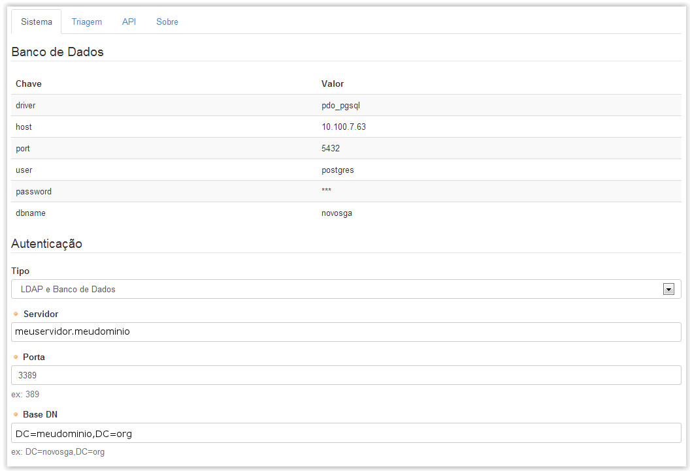
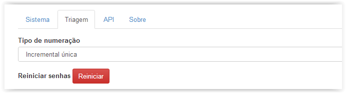
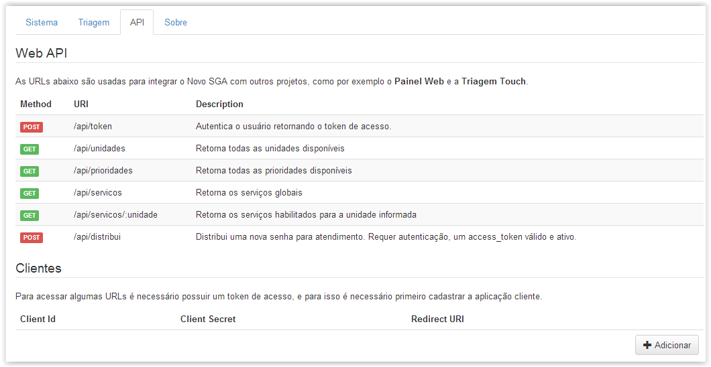

# Administração

!> **Atenção** Você está vendo uma documentação antiga. A versão v1.0.0 foi lançada em Dezembro de 2013.

Nesse menu é possível realizar as configurações principais que nortearão o funcionamento do sistema com relação ao modo de autenticação, geração das senhas na triagem e integração com outros aplicativos.

Abaixo é apresentada a tela inicial desse menu.

Existem 3 abas onde podem ser feitas as configurações necessárias.

Sistema: Nessa aba são revisadas as configurações de banco de dados, como também a integração com uma base LDAP de sua escolha. (Vide figura acima)

Triagem: Nessa aba é feita a configuração relacionada ao tipo de numeração das senhas que serão geradas na Triagem.

Caso seja selecionado o tipo “Incremental por serviço”, cada serviço configurado para a unidade terá sua própria fila de senhas. Por exemplo: Temos os serviços “Atendimento Cidadão” e “Atendimento Advogado”, para cada um dos serviços haverá uma fila única onde a senha gerada em um deles não interfere na ordem das senhas geradas para o outro serviço. Nesse caso: A001, A003 e B001, B002.

Caso seja selecionado “Incremental única”, não importa quantos serviços existam, haverá apenas uma fila geral. Por exemplo: Caso existam os serviços “Atendimento Cidadão” e “Atendimento Advogado” existirá uma única fila que incluirá as senhas dos dois serviços na ordem em que foram geradas. Isto é: A001, A002, A003.

A figura acima mostra a tela da Triagem no Menu Administração. É possível ainda reiniciar a geração das senhas.

!> Importante Cuidado! Ao reiniciar as senha utilizando esse menu, não somente as senha de uma unidade são reiniciadas, mas as senhas de todas as unidades são reiniciadas. Usar esse recurso parcimoniosamente.

API: Nessa aba é possível integrar outros aplicativos ao sistema. Como por exemplo, a “Triagem Touch” e “Painel Web”.

Em alguns casos é necessário configurar uma senha para controlar o acesso da aplicação às informações disponíveis no sistema. Isso não é necessário para o “Painel Web”.
