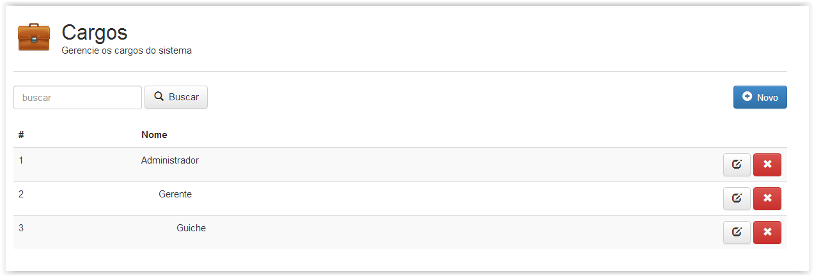
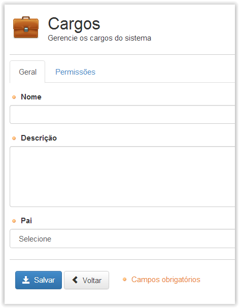
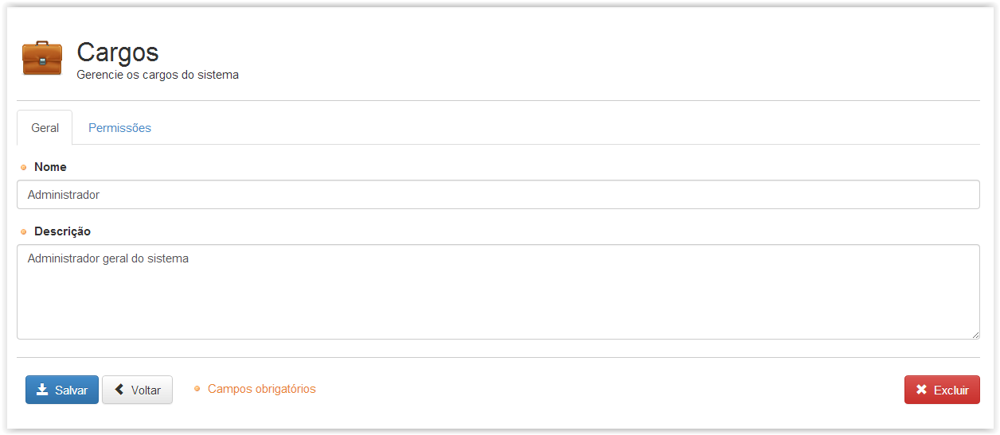
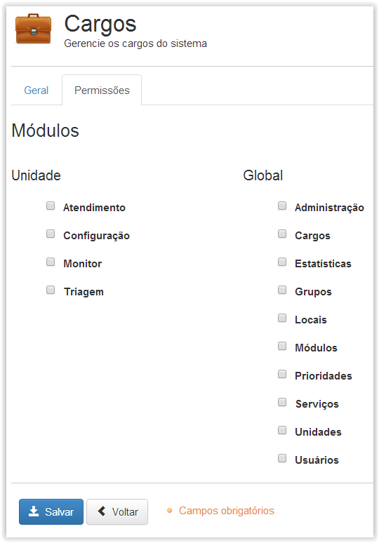

# Cargos

!> **Atenção** Você está vendo uma documentação antiga. A versão v1.0.0 foi lançada em Dezembro de 2013.

Nesse menu definimos os papéis que terão parte nas atividades de gerenciamento do sistema de atendimento. Serão definidas as permissões que cada papel terá. Por padrão a ferramenta oferece apenas o papel Administrador.

Abaixo é apresentada a tela inicial do menu. Nessa tela é possível editar os Cargos criados anteriormente e criar um novo cargo conforme necessário.

Ao clicar no botão “Novo” é apresentada a tela abaixo, onde é possível ajustar as permissões nos módulos disponíveis e informações relacionadas ao novo cargo criado.

Quando editamos um cargo existente é possível redefinir as permissões de acesso que este terá, como também, alterar outras propriedades como descrição, nome e objeto pai. Para confirmar as novas propriedades é necessário clicar no botão “Salvar”, depois de realizadas as alterações. (Vide figura abaixo)

!> Importante

- O cargo raiz (‘Administrador’) não pode ser removido, apenas editado
- Note que é necessário que o novo cargo possua um Cargo “Pai”. Sem que isso seja especificado não é possível finalizar a criação do mesmo.
