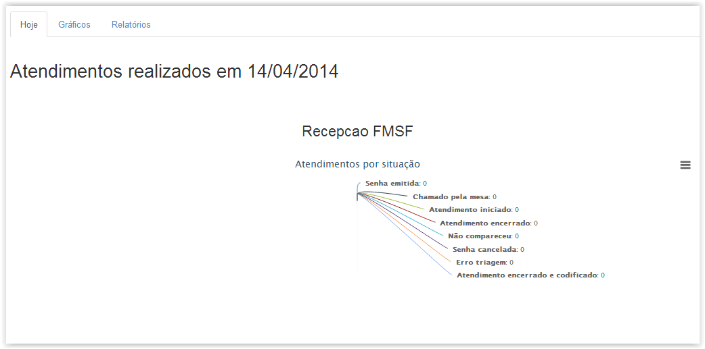
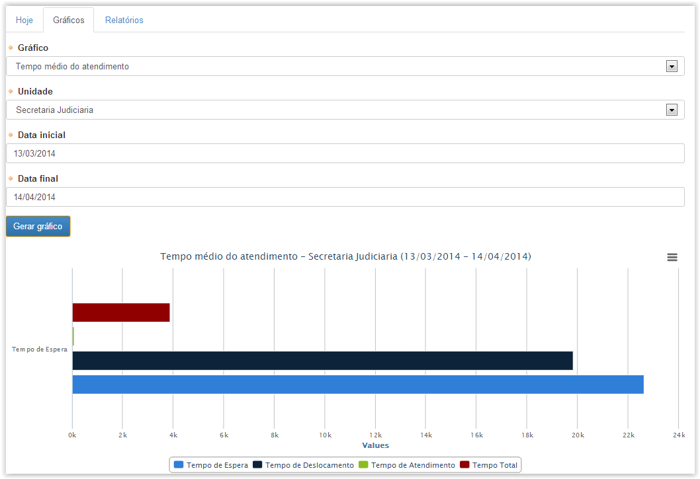
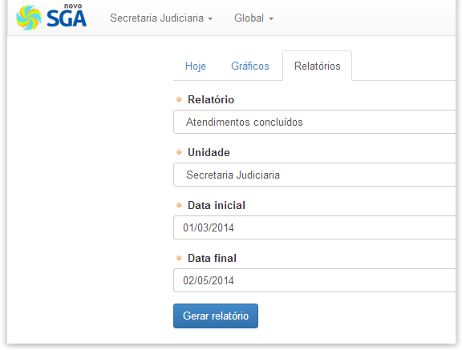
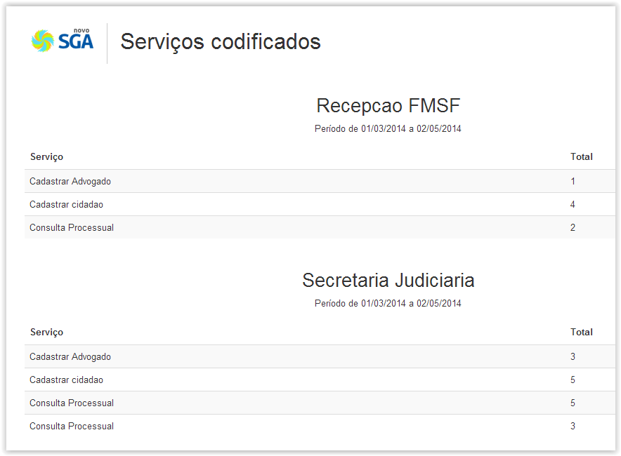

# Módulos Globais

!> **Atenção** Você está vendo uma documentação antiga. A versão v1.0.0 foi lançada em Dezembro de 2013.

Nesse menu podemos visualizar as estatísticas de atendimento para as unidades existentes.

Abaixo é exibida a tela inicial desse menu:

Esse menu traz 3 abas onde podemos visualizar as estatísticas das unidades em formas diferentes.

Na aba “Hoje” são exibidas as estatísticas para o dia atual dividido em duas categorias: “Atendimentos por Situação”, isto é por status, e ainda “Atendimentos por Serviço” o que contabilizará os atendimentos por serviços. Não é possível filtrar os gráficos por unidade, as informações de todas as unidades são apresentadas de uma só vez.

Na aba “Gráficos” são apresentados 3 tipos de gráficos que podem ser exibidos por unidade num período de tempo especificado:

Além dos gráficos de “Atendimento por Serviço” e “Atendimento por Situação” que foram mencionados anteriormente, também é possível a geração de um gráfico de “Tempo médio de atendimento”. Após a seleção do tipo de gráfico, a unidade de atendimento e o intervalo de tempo poderemos então clicar em “Gerar Gráfico”.

Na aba “Relatórios” é possível extrair relatórios customizados para os seguintes itens: Serviços disponíveis – Global, Serviços Disponíveis – Unidade, Serviços Codificados, Atendimentos Concluídos, Atendimento em Todos os Status, Tempos médios por Atendente, Lotações e Cargos. (Vide figura abaixo)

Para gerar um novo relatório é necessário selecionar o tipo de relatório desejado e definir o intervalo de tempo que será auditado. Após selecionar esses parâmetros, podemos clicar em “Gerar Relatório” para que seja aberta uma outra aba no navegador exibindo os dados solicitados, como pode ser visto na figura abaixo:

