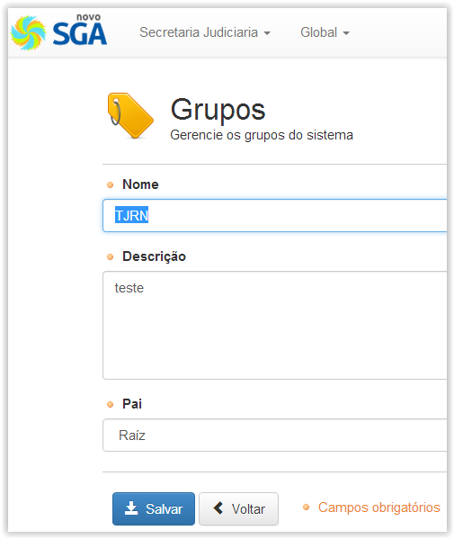
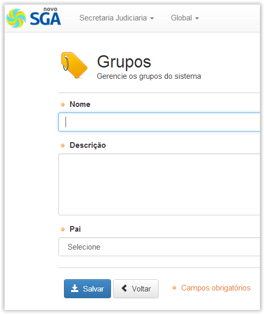

# Grupos

!> **Atenção** Você está vendo uma documentação antiga. A versão v1.0.0 foi lançada em Dezembro de 2013.

Nesse menu criamos os grupos onde residirão as nossas unidades de atendimento. Abaixo podemos ver a tela inicial desse menu:

_images/modulo-grupos.png
Aqui podemos criar novos grupos ou ainda editar grupos previamente criados. Caso criemos um novo grupo, devemos primeiro preencher os dados específicos, então ao terminar o preenchimento dos dados clicamos em “Salvar”. É possível criar subgrupos caso seja necessário. Para isso, basta definir o “Pai” do grupo como sendo algum dos outros grupos previamente criados, antes de finalmente clicarmos em “Salvar”. Como mostrado nas figuras abaixo.

!> Importante

- O grupo raiz (‘Raiz’) não pode ser removido, apenas editado
- É importante lembrarmos que só podemos colocar uma unidade de atendimento por Grupo. NÃO É POSSÍVEL AMPLIAR ESSE NÚMERO. Cada unidade deverá possuir seu grupo específico. Certifique-se de criar a quantidade de grupos necessários para abrigar suas unidades de atendimento. Isso afetará a criação de novas unidades, o parâmetro grupo é obrigatório para todas as unidades.
