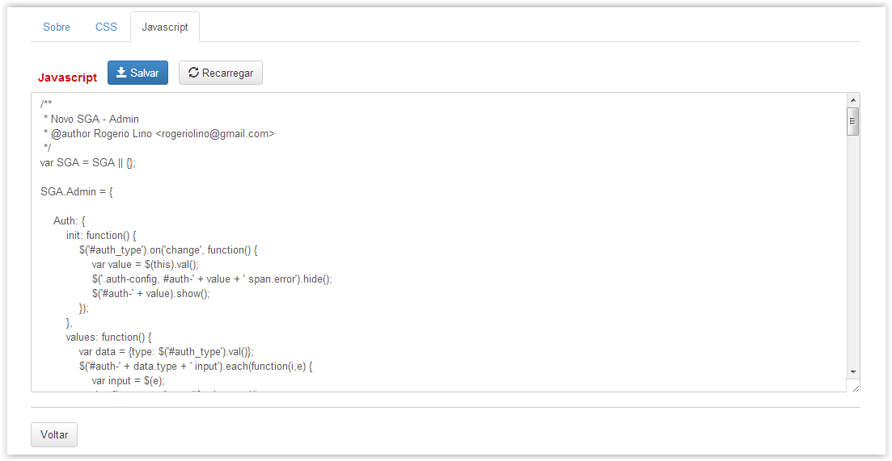

# Módulos Globais

!> **Atenção** Você está vendo uma documentação antiga. A versão v1.0.0 foi lançada em Dezembro de 2013.

Nesse menu é possível editar o código fonte dos módulos existentes na aplicação. Abaixo é exibido a tela inicial do menu.

Esse menu permite a criação de novos módulos como também editar os módulos atuais. Essa ferramenta visa facilitar o trabalho dos desenvolvedores.

Ao clicar no botão “Editar” em algum dos módulos disponíveis é exibido o CSS e Javascript do módulo correspondente. (Vide figura abaixo)

Após realizar as alterações necessárias é possível salvar as alterações e recarregar o módulo de modo que as alterações realizadas possam ser aplicadas.

