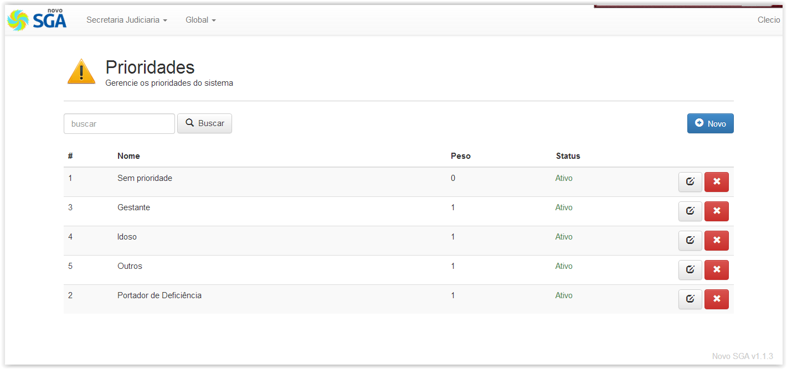
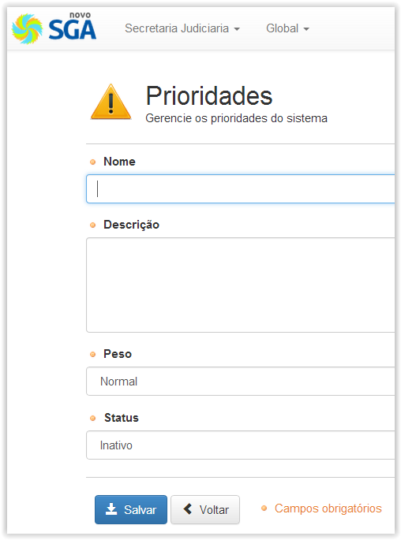

# Prioridades

!> **Atenção** Você está vendo uma documentação antiga. A versão v1.0.0 foi lançada em Dezembro de 2013.

Nesse menu é possível definir novos tipos de Prioridades para atendimentos especiais, como também definir o peso que as prioridades existentes terão umas sobre as outras.

Por padrão a ferramenta oferece as prioridades que seguem: Sem Prioridade, Gestante, Idoso, Portador de Deficiência e Outros.

Na configuração padrão todas as prioridades possuem peso ou valor “1”, com exceção do tipo chamado “Sem Prioridade” que tem peso ou valor “0”.

O menu ainda permite a criação de novas prioridades como também a edição dos dados de alguma prioridade previamente existente. Ao clicar em “Novo” será exibida a tela abaixo onde poderão ser completados os dados da nova prioridade.

Ao clicar em “Salvar” a nova prioridade é criada e passa a constar na lista de prioridades existentes.

O mesmo ocorre quando se deseja alterar uma prioridade previamente criada. Após clicar no botão “Editar” é exibida janela similar onde após alterar os dados desejados é possível “Salvar” todas as alterações realizadas.

!> Importante

- Caso a Prioridade conste como “Inativa” em seu status exibido nesse menu, isso significará que a mesma não estará disponível para seleção no menu “Triagem”. Atente para este detalhe ao alterar uma prioridade existente ou criar uma nova.
- Lembre-se que alterar o valor padrão das prioridades influenciará diretamente a ordem de enfileiramento das senhas de atendimento prioridade no Menu Triagem. A tarefa de definição de pesos para os atendimentos de prioridade exige planejamento prévio para que não ocasione desentendimentos e confusões entre os atendentes nos guichês, assim como para os usuários.
