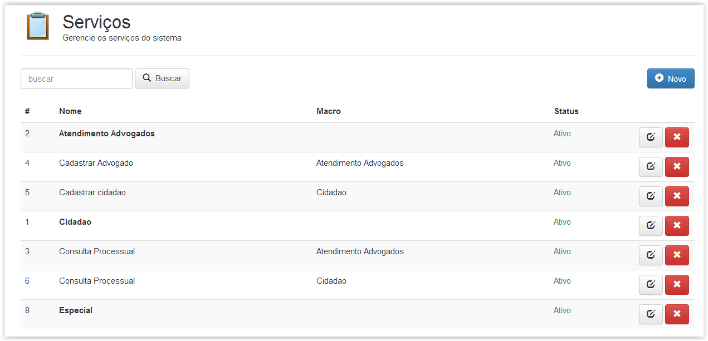
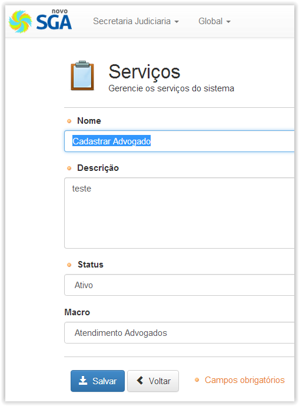

# Serviços

!> **Atenção** Você está vendo uma documentação antiga. A versão v1.0.0 foi lançada em Dezembro de 2013.

Nesse menu é onde configuramos os serviços que estarão disponíveis para os atendentes codificarem o atendimento realizado ao encerrar seu atendimento.

Os serviços configurados nesse menu também são aqueles que serão apresentados durante a Triagem, onde é feita a geração das senhas.

Nesse menu é possível a criação de um novo serviço, ou ainda editar as opções de algum serviço criado previamente. (Vide figura abaixo)

Caso crie um novo serviço, após preencher os dados do mesmo poderá clicar em salvar para que o novo serviço passe a ser listado na página inicial desse menu.

Os serviços podem estar encadeados indicando que são subserviços componentes de uma categoria específica. Caso esteja criando “subserviços” vinculados a uma categoria, então precisará indicar o serviço “Macro” ou pai desses subserviços. Tal serviço macro tem que ter sido criado previamente para que seja possível vincular a este os novos subserviços.

Na figura anterior é mostrada a tela inicial do menu serviços, onde podem ser vistos serviços principais como categorias em negrito e seus correspondentes subserviços:

!> Importante

É importante notar que nessa versão do novosga, por padrão, as estatísticas são geradas apenas para os serviços principais criados. Isto é, caso deseje criar subserviços, não será possível visualizar as estatísticas por subserviço criado. Caso a intenção seja rastrear detalhadamente as estatísticas para cada serviço criado então é recomendado a criação de todos os subserviços como se fossem serviços principais.
