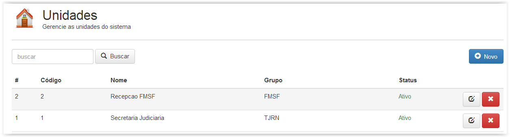
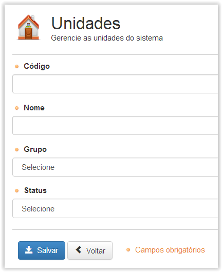

# Unidades

!> **Atenção** Você está vendo uma documentação antiga. A versão v1.0.0 foi lançada em Dezembro de 2013.

Aqui criaremos nossas unidades de atendimento e decidiremos quais estão ativas ou inativas. Na figura abaixo a tela inicial desse menu é apresentada.

Ao criar uma nova unidade é necessário informar o Grupo ao qual esta faz parte e definir se a mesma será criada como ativa ou inativa. Ainda é possível realizar alterações nas unidades previamente criadas. Após clicar no botão editar, a direita da unidade desejada, é necessário informar os novos dados, então finalmente clicar em “Salvar” para efetuar as mudanças desejadas.

!> Importante

Toda unidade deve estar vinculada a um grupo folha (último nível), e caso o grupo que unidade esteja associada receba um novo filho, a unidade passará a estar vinculada a esse novo grupo folha.

