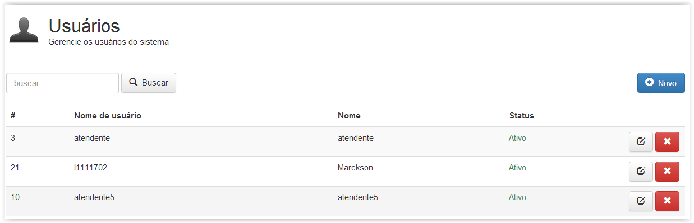
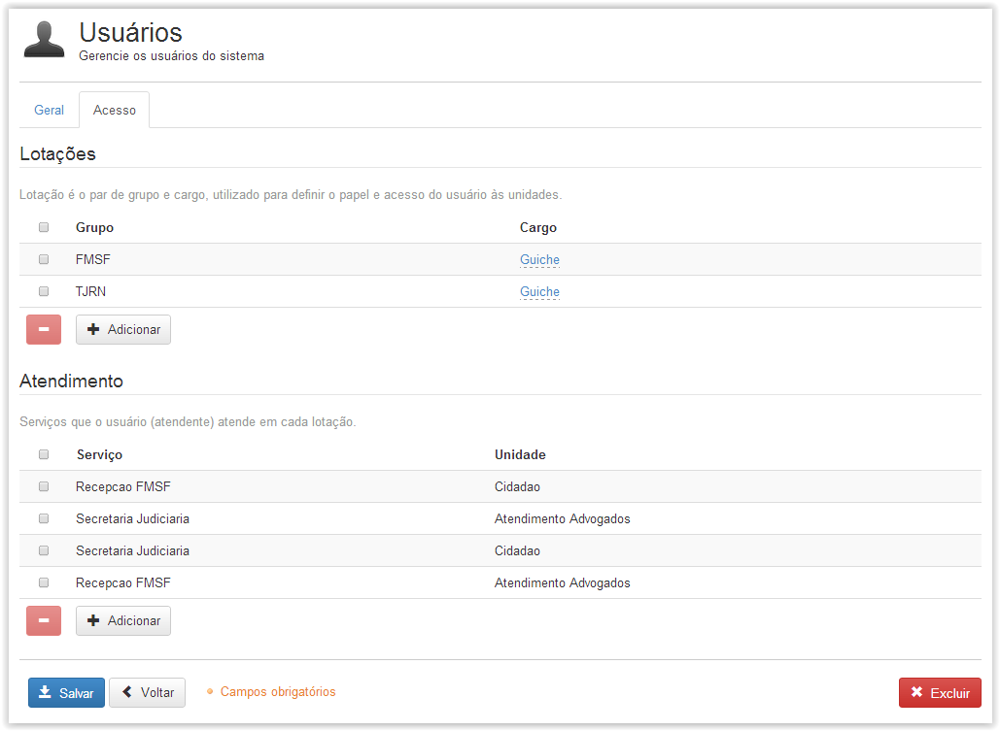
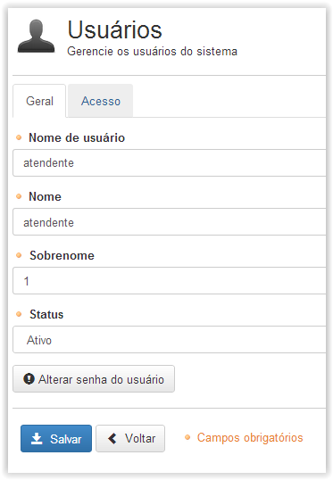

# Usuários

!> **Atenção** Você está vendo uma documentação antiga. A versão v1.0.0 foi lançada em Dezembro de 2013.

Nesse menu os usuários são criados. A criação de usuários pode ser feita manualmente, ou automática. Quando o sistema está configurado para funcionar integrado ao Active Directory, os usuários são criados automaticamente.

Abaixo visualizamos a tela inicial desse menu:

Nessa tela podemos editar as configurações para um usuário específico, excluir algum usuário ou criar um novo usuário.

Na aba acesso encontramos as opções Lotações e Atendimento

Em Lotações você define em quais unidades de atendimento o usuário terá acesso e poderá realizar atendimentos.

Em Atendimento definimos os serviços, ou filas, nas quais o usuário em questão terá acesso para as lotações definidas anteriormente.

Na tela de edição do usuário, basta modificarmos as opções necessárias, para confirmar as alterações clicamos em “Salvar”.

Na aba Geral podemos modificar outras opções, são elas: Nome de usuário, Nome, Sobrenome, Status e Senha.

Após a realização das alterações necessárias, para que elas sejam aplicadas, é necessário clicar no botão salvar, como podemos visualizar na figura abaixo:

!> Importante

- Se o usuário for lotado em um grupo raiz (ou não folha) automaticamente terá acesso a todas as unidades vinculadas aos nós folha desse grupo com o cargo dessa lotação.
- Para que seja possível adicionar as configurações de Lotação e Atendimento do modo adequado é necessário que, antes disso, os Grupos, Unidades, Cargos e Serviços também tenham sido configurados previamente. Caso não encontre um Cargo, Unidade, Grupo ou Serviço específico para configurar no usuário, isso poderá significar que alguma etapa da configuração inicial ainda não foi feita. Revise a configuração dos menus citados anteriormente.
