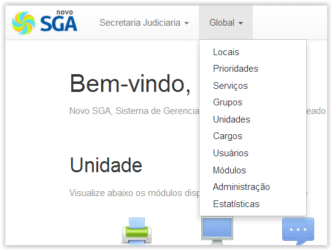

# Módulos Globais

!> **Atenção** Você está vendo uma documentação antiga. A versão v1.0.0 foi lançada em Dezembro de 2013.

Os módulos globais são aqueles que afetam todas as unidades, ou que por algum motivo não tem relação com nenhuma unidade em particular.

