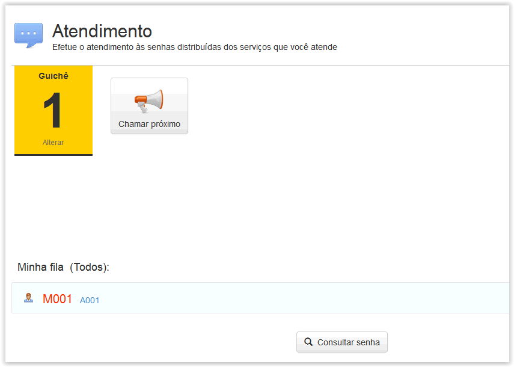
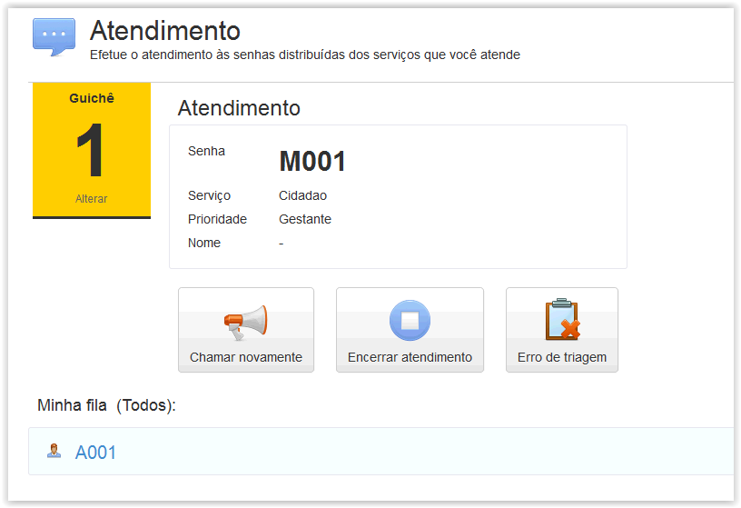
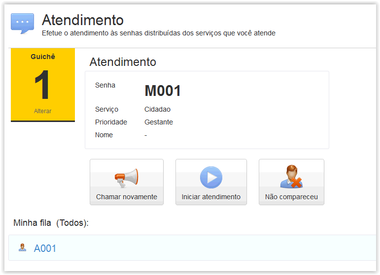
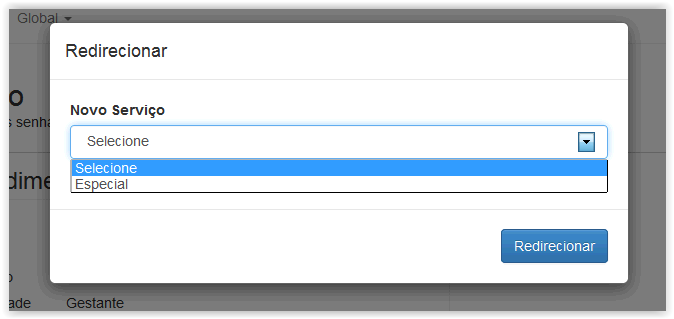
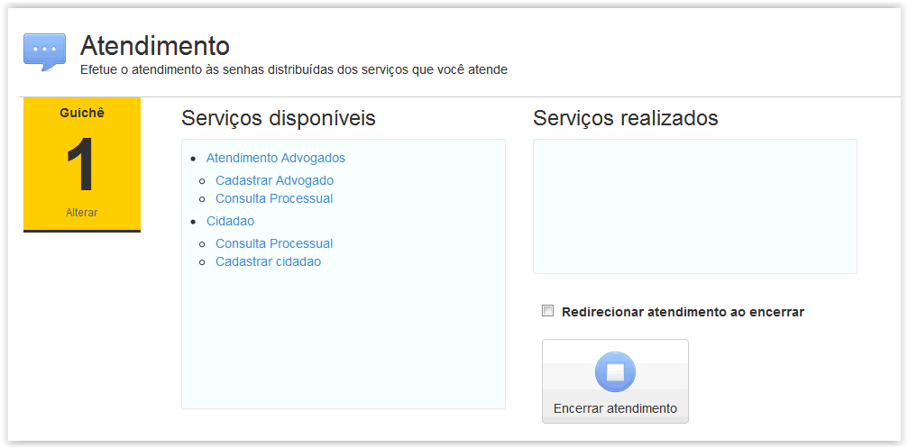

# Atendimento

!> **Atenção** Você está vendo uma documentação antiga. A versão v1.0.0 foi lançada em Dezembro de 2013.

Nessa área é possível informar o número do guichê no qual o atendente irá chamar as senhas, como também definir as filas nas quais operará.

Assim que acessamos esse menu, nos é solicitado o número do guichê no qual realizaremos os atendimentos, como também se atenderemos todas as filas, se somente os atendimentos convencionais ou se também os de prioridade. Como pode ser visto na figura a seguir:

Após selecionar suas opções poderá clicar em salvar para ser direcionado a tela principal de atendimento.

Na tela principal de atendimento é possível chamar a próxima senha, alterar o número do guichê entre outras opções que ficam disponíveis apenas após chamar uma senha, como exibido na figura a seguir:

A fila de senhas esperando atendimento é exibido na parte inferior do vídeo sempre que se entra no menu atendimento. Após chamar uma senha são exibidas algumas outras opções, como podemos ver na figura a seguir:

Após chamar a senha pela primeira vez, é possível chamá-la novamente, iniciar o atendimento quando o usuário se apresenta ao guichê ou ainda indicar que a senha não compareceu para que a mesma seja retirada da fila e dê a vez para a próxima senha aguardando atendimento.

Após iniciar o atendimento, a opção erro de triagem aparece para que seja possível indicarmos que a pessoa foi para o guichê errado, dessa forma podemos redirecionar a senha dela para o guichê correto onde o serviço requisitado poderá ser atendido. (Vide próxima figura)

Após clicarmos em “Erro de Triagem” será exibida a caixa de seleção a seguir que nos permitirá direcionar o usuário da senha ao guichê onde o serviço desejado é atendido:

Após o devido atendimento dos serviços solicitados pelo usuário é necessário fazer a codificação do atendimento que foi realizado. Após clicar em “Encerrar atendimento” o atendente no guichê será direcionado para janela abaixo onde poderá selecionar os serviços que foram atendidos a pedido do usuário em questão. Ao clicar nos “Serviços disponíveis” que foram atendidos, isso os move para seção “Serviços realizados”. Finalmente, após codificar os serviços atendidos clique em “Encerrar atendimento” para finalizar seu atendimento. (Vide próxima figura)

Desse modo é possível rastrear quais atendimentos demandaram mais tempo, entre outras informações que auxiliarão o gestor na tomada de decisão posterior caso decida-se alterar o fluxo de atendimento.

!> **Importante** 
- 1. Os serviços disponíveis para codificação do atendimento têm de ser cadastrados previamente na ferramenta para que estejam disponíveis para os atendentes selecionarem na página de encerramento do atendimento. Caso algum serviço não apareça, isso indicará que tal serviço não foi cadastrado.
- 2. Caso exista algum serviço adicional que o atendente não possa fazer, porém é contemplado por outro guichê, nesse caso o atendente poderá ao encerrar redirecionar a senha para outro guichê marcando antes de clicar em “Encerrar atendimento” a opção “Redirecionar atendimento ao encerrar”.
