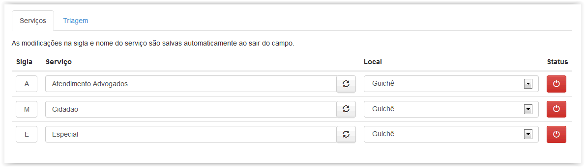
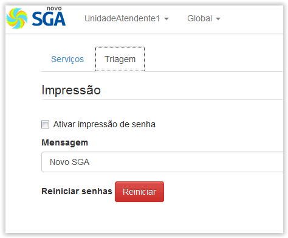

# Configuração

!> **Atenção** Você está vendo uma documentação antiga. A versão v1.0.0 foi lançada em Dezembro de 2013.

Esse menu possui duas seções, são elas: Serviços e Triagem. Na aba Serviços é possível definir uma Sigla ou Letra Inicial que indicará o tipo de serviço que está sendo atendido, é possível também ativar o atendimento a um serviço, o que significa que será possível gerar as senhas na seção Triagem para tal serviço, como podemos visualizar no menu abaixo:

!> **Importante** A Sigla definida aqui será a letra exibida no Painel de Senhas quando uma senha for chamada. Ex.: C004, D005.

Na Triagem disponível nesse menu é possível ativar a impressão das senhas, incluir uma mensagem customizada para ser impressa abaixo do número da senha, como também, reiniciar a contagem de senhas. Vide figura abaixo.

