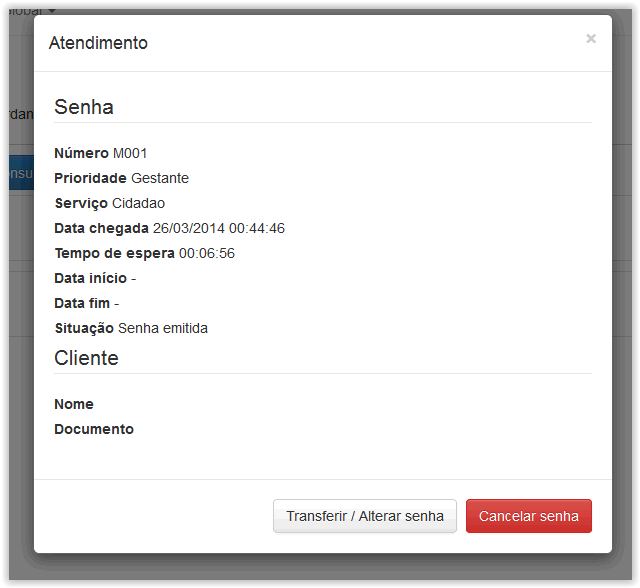

# Monitor

!> **Atenção** Você está vendo uma documentação antiga. A versão v1.0.0 foi lançada em Dezembro de 2013.

Nesse menu é possível monitorar, alterar ou cancelar as senhas que aguardam atendimento. Vide figura abaixo.

[modulo-monitor](_images/modulo-monitor.png)

São exibidas as senhas que aguardam atendimento, para alterá-las ou cancelá-las basta clicar na senha desejada, então será exibida uma janela com as informações da senha.

Após revisar as informações da senha podemos clicar em “Alterar” ou “Cancelar” de acordo com o que desejamos fazer, como pode ser visto na figura abaixo:

Caso a senha seja alterada ou transferida para outra fila as mudanças serão imediatas. Caso cancele a senha, esta será automaticamente removida da fila de espera.

!> **Importante** O Cancelamento de senhas não pode ser desfeito. Favor revise as informações da senha antes de confirmar o cancelamento para evitar equívocos.
