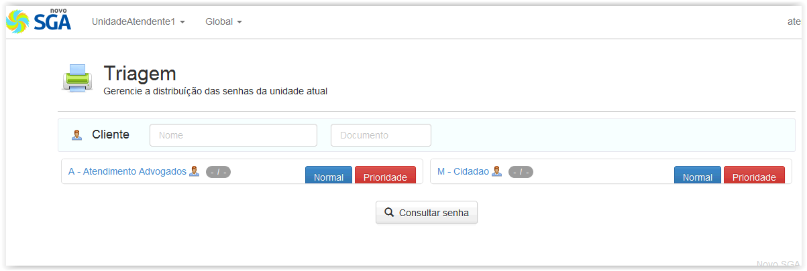
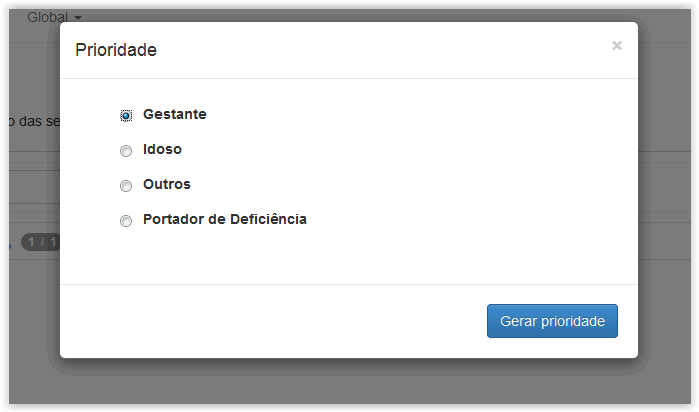
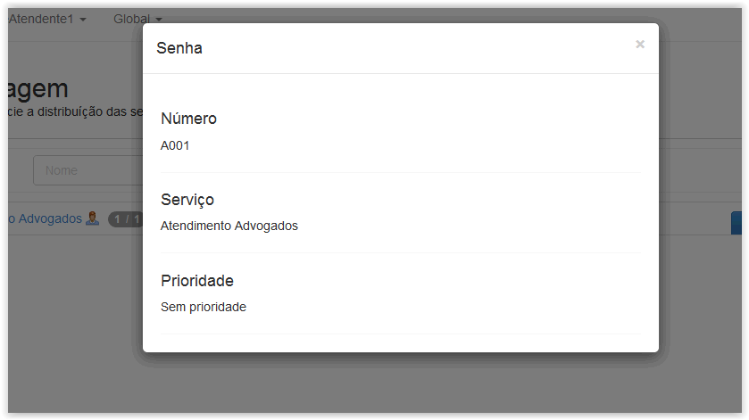

# Triagem

!> **Atenção** Você está vendo uma documentação antiga. A versão v1.0.0 foi lançada em Dezembro de 2013.

Nesse módulo é feita a geração das senhas em cada serviço cadastrado. Ele permite a personalização do atendimento por disponibilizar alguns campos adicionais que possibilitam o acréscimo do nome do usuário e do documento que foi apresentado ao receber a senha, como pode ser visto na figura abaixo.

!> **Importante** São apresentados aqui apenas os serviços que foram habilitados no menu configuração, caso algum outro serviço existente não apareça verifique se o mesmo já está habilitado no menu configuração.

É possível gera senhas normais para atendimento convencional como também senhas especiais para pessoas que precisam de alguma prioridade no atendimento. Para criar uma senha para atendimento convencional basta apenas clicar no botão “Normal” ou “Prioridade” correspondente, no serviço no qual o usuário deseja atendimento. Se desejado poderá adicionar o nome da pessoa e o documento que foi apresentado antes de gerar a senha. caso a senha gerada tenha sido uma senha especial, na qual é necessário especificar o tipo de prioridade do usuário, será apresentada a janela adicional abaixo.

Após definir o tipo de prioridade do usuário, basta apenas clicar em “Gerar prioridade”, para que a senha seja gerada.

Após a conclusão da geração da senha é exibida a janela abaixo com as informações da senha gerada:

Para dispensar a janela, poderá clicar no botão fechar da janela, clicar com o cursor do mouse em qualquer região fora da janela ou ainda apertar a tecla ESC em seu teclado.

