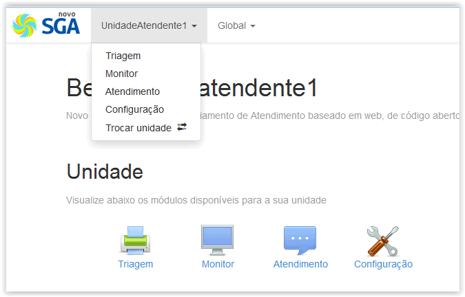

# Módulos Locais

!> **Atenção** Você está vendo uma documentação antiga. A versão v1.0.0 foi lançada em Dezembro de 2013.

Nos módulos Locais estão os módulos específicos de cada unidade. Estes só estarão visíveis quando o usuário logar em uma unidade, e as configurações afetarão apenas esta unidade.

