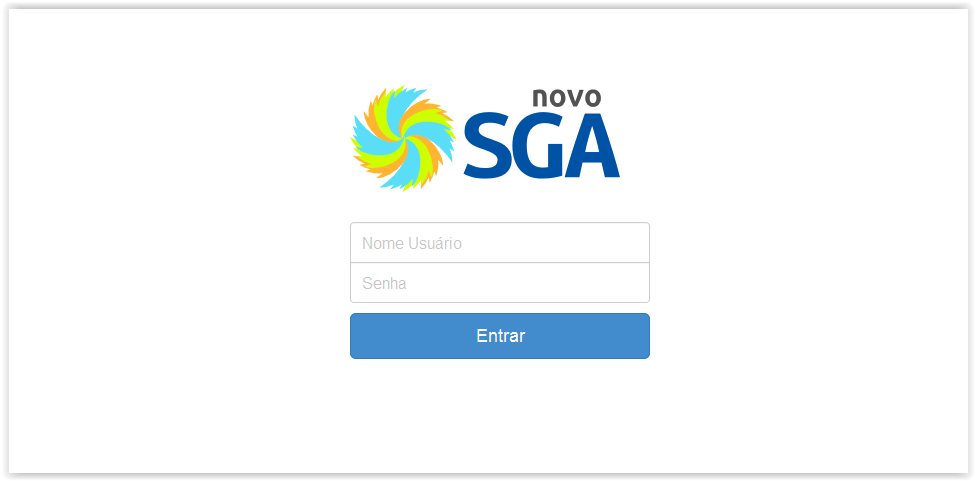

# Login no sistema

!> **Atenção** Você está vendo uma documentação antiga. A versão v1.0.0 foi lançada em Dezembro de 2013.

Abra seu navegador de internet (Mozilla Firefox, Google Chrome, Internet Explorer.. etc) e digite o endereço do site.

Você será apresentado a tela de login do sistema como mostrado na figura abaixo:

Para ter acesso ao sistema entre com seu nome de usuário e senha.

Feito o login, e caso a organização possua mais de uma unidade, será solicitado que selecione sua unidade de atendimento:

Feita a seleção clique no botão enviar para seguir para tela inicial.

